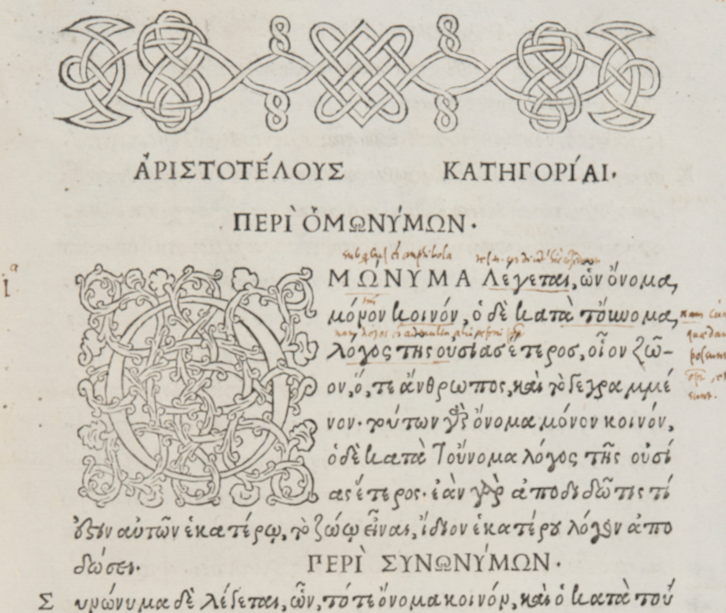
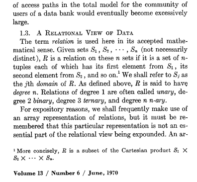
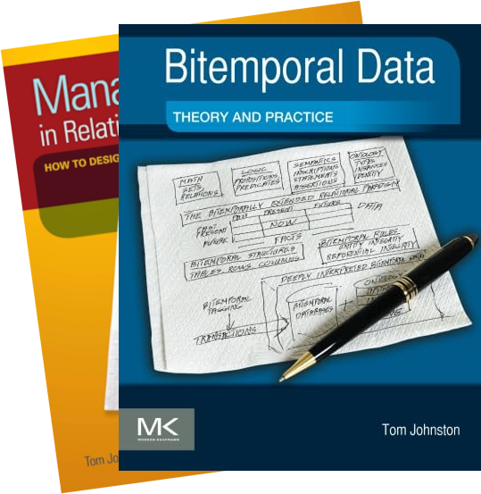
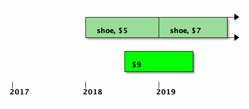
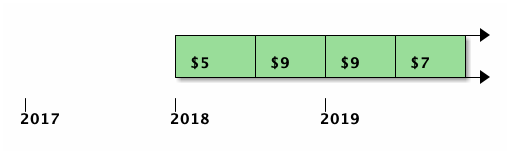
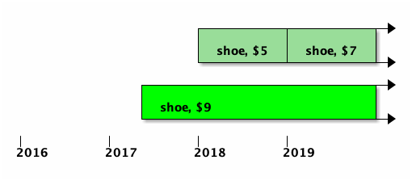
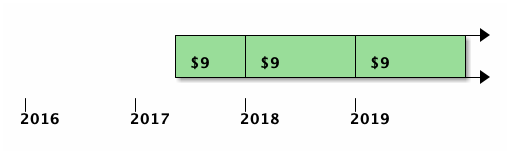

# Temporal Databases:
## Theory and Postgres 2024

Paul A. Jungwirth<br/>
20 June 2024<br/>
pdxpug

Note:

- Thanks for coming!
- I'm Paul Jungwirth....
- independent consultant/programmer
- used Postgres since ~2010.

- I've been interested in temporal databases for more than ten years.
- I've read all the books in English and a lot of the papers.
- Almost every project I work on I wish I had easy temporal database support.
- Now that SQL:2011 has standardized some of the functionality,
  more and more vendors are supporting it,
  and I hope Postgres will too!
  I've been working on "application time" myself, but there is also "system time".
- I want to give an overview of temporal concepts and features,
  how they appear in SQL:2011, and how we're supporting them in Postgres.
- Then I want to talk about some ideas for the future.


# The Problem
## Lost Information

<!-- .slide: style="font-size: 80%" -->
- finance: market data <!-- .element: class="fragment" -->
- questionnaires: changing questions, options <!-- .element: class="fragment" -->
- e-commerce: product price, other attributes <!-- .element: class="fragment" -->
- real estate: house renovations <!-- .element: class="fragment" -->
- employees: position, salary, employment period <!-- .element: class="fragment" -->

Note:

- The problem temporal databases solve is lost information.
  Whenever you UPDATE or DELETE, you lose what was there before.
- I've consulted with dozens of companies over the years,
  but I don't think a single one could re-generate a year-old report
  and get the same answers as before.
  - If you're talking about financial documents, that seems like a problem.
  - Finance seems to be a big one.
    - Hettie Dombrovskaya's has a Postgres extension originally built for this purpose.
    - XTDB (which is not Postgres) is built by finance people.
    - Lots of other examples.
  - One company built surveys to measure the effectiveness of social services.
    These were mostly multiple-choice questions, like "What is your ethnicity?"

    People were always changing the *questions* or the *choices* after they already had some answers.
    So when that happens, how do you trust your conclusions?
  - Or imagine an e-commerce site.
    If you didn't capture an item's price when it was sold,
    you could show a wrong order total later.
    Of course everyone does capture the price,
    but how about other product details, like color, category, etc.?
  - Note that both of these examples are causing errors across a foreign key:
    a child record didn't change, but its parent changed, and so in effect it changed too.
  - Or Zillow when a house changes.
  - Or (everyone's favorite database example): an employee's positions, salaries, projects, or tenure.

- Of course you can capture history if you want.
  - It's hard to capture *all* the history,
    but you need it all because in a database every table is connected.
  - I've seen a lot of ad hoc, partial, badly designed history solutions,
    all different and all with bugs.
    - For instance who uses soft-delete?
      In the Rails world people like to use a `deleted_at` column. Same thing in Django.
      But another table can hold a reference to a soft-deleted record.
      How do you restrict or cascade foreign keys with soft deletes?
      How do you systematically exclude soft-deleted records, without ever messing up?
      What if the record gets un-deleted later?
  - And soft deletes are actually pretty easy.
    It really falls down around joins, e.g. the issues across foreign keys above.


# OLAP Problems Too


Note:

- OLAP schemas have problems too.
- They are denormalized, so duplication does help retain historical information.
  - ... at least in the fact table in the center.
    - Facts capture history because they are almost always dated.
  - The dimensions don't necessarily have history.
    - products change
    - stores come and ago and change
    - Kimball calls these "slowly-changing dimensions" (SCDs).


# "Slowly-Changing Dimensions"
<!-- .slide: style="font-size: 80%" -->

- Type I: Overwrite it
- Type II: Add a Row
- Type III: Add a Column (good for one change)

later: <!-- .element: class="fragment" data-fragment-index="1" -->

- Type IV: Mini-dimensions <!-- .element: class="fragment" data-fragment-index="1" -->
- Type V: Mini-dimensions with outriggers <!-- .element: class="fragment" data-fragment-index="1" -->
- Type VI: Original vs Current <!-- .element: class="fragment" data-fragment-index="1" -->
- Type VII: Type I + Type II <!-- .element: class="fragment" data-fragment-index="1" -->

Note:

- Slowly-changing dimensions are proof that even OLAP databases need temporal features.
- Tom Johnston has a lot to say about this in his blue temporal book.
  - "Real talk, what do you mean slow?"

- Basically none of Kimball's suggestions are very good:
  - In his original book he gave us solutions he called Types I, II, III.
  - Later we've got 4, 5, 6, 7, 0, 1.5.
  - I take this as evidence that temporal features are needed.


# The First DBA?

<!-- .element: style="float:left; width:48%" -->
<!-- .element: style="float:left; margin-left:1em; width:44%" -->

Note:

- I blame Aristotle.
- Everyone knows that a row in your table is a true proposition, as if from Aristotelian logic.
- But true always? At this moment? When it was added? It's loose.

- Actually I finally started reading Aristotle, and there is a lot in there about time!
  - Take his Περὶ Ἑρμινεῖας . . . okay maybe later.
- So maybe it's Codd's fault.

- At any rate, in practical relational databases, things are changing all the time.
- We don't model being, but becoming.
- As another famous DBA once wrote, "πάντα ῥεῖ."


# Research


Note:

- Fortunately we've got 30+ years of research, we should use it!
- This is the first book about temporal databases, by Richard Snodgrass.
  - Well I recently discovered collection of academic papers he edited that's even earlier. I haven't read that one yet.
- Published in 1999, though my copy says copyright 2000.
- It shows how to do everything.
  - valid-time, system-time, bitemporal.
  - snapshot query vs sequenced vs non-sequenced
  - inner join vs outer join

  - It gives SQL for everything.
    - If you are building a temporal database in Informix or UniSQL, he's got you covered.
    - Also Oracle, DB2, Access, and MS SQL Server.

- Snodgrass led a standardization effort back in the 90s that didn't quite succeed.
  - Some say SQL:2011 is based on that, but not completely.


# Research


Note:

- Here is Date/Darwen/Lorentzos:
  - This book has the most formal, rigorous approach I've found.
  - Their idea is that ideally you'd have one row per second (or millisecond or whatever),
    and then you don't need anything special: everything just works.
  - We use intervals to abbreviate that as an optimization, but the ideal model often helps answer questions about how they should function.
  - What Date called intervals inspired Postgres range types.
- This is probably my favorite of all the temporal books.


# Research


Note:

- Johnston has two books, one co-authored by Randall Weiss.
- The blue one is way more interesting.
- They have some extensions to MS SQL Server to do temporal stuff for you.
- He also doesn't quite like the standard and deviates from it in some ways.
- I mentioned Johnston earlier regarding slowing-changing dimensions.


# Temporal<br/>`IS DISTINCT FROM`<br/>Time-Series
<!-- .slide: style="font-size: 70%" -->

time-series | temporal
----------- | --------
single timestamp | two timestamps
records events       | records things, "versions"
IoT sensors, finance | auditing, history
challenge is scale   | challenge is complexity
partitioning         | ranges, exclusion constraints
TimescaleDB          | `periods`, `pg_bitemporal`

Note:

- To start with, a temporal database is not the same as a time-series database.
- Nowadays time-series is all the rage, with web analytics, advertising, IoT sensor data, APM metrics.
- Temporal is something else.
- In time-series every record has a single time stamp; in temporal every record has two: start & end.
- In time-series you record events; in temporal, things (different versions throughout the thing's lifetime)
- Challenges:
  - time-series: scale (but the structure is simpler)
  - temporal: moderate scale, but lots of complexity. Correctness is a challenge.
- Tools in Postgres:
  - timeseries: partitioning
  - temporal: ranges, exclusion constraints: very solid foundation, but no higher-level concepts yet
- Products in Postgres:
  - timeseries: Citus, TimescaleDB
  - temporal:
    - Teradata has had support for a long time
    - `temporal_tables` extension gives you one dimension (db history) but not the other (thing history).
    - Vik Fearing has an extension that gives application-time support. It's called just `periods`, so it's hard to search for.
    - Hettie Dombrovskaya has an extension on github too.
      - She's been working with temporal data for years and has lots of talks on it.
      - Turns out her husband, Boris Novikov, does temporal work too.


# Two Dimensions
<!-- .slide: style="font-size: 60%" -->

Application Time | System Time
-----------------|------------
history of the thing | history of the database
application features | auditing, compliance
user can edit        | immutable
maintained by you | maintained by Postgres
constraints matter | look Ma, no hands!
`periods`, `pg_bitemporal` | `temporal_tables`, `pg_audit_log`
nothing | Rails: `papertrail`, `audited`, `chronomodel`, ...

Note:

- In fact there are two kinds of history we'd like to track. (Maybe more!)
- There is system time, which is kind of like "who changed what when?".
  - When did the *database* change?
  - Actually SQL:2011 doesn't give you "who", only "what" and "when".
  - Lots of people need this for auditing and compliance.
  - There are lots of extensions for this, or it's not hard to build some triggers yourself.
  - Your database just sort of maintains it for you in the background.
- Then there is application time, which is when the thing changed out in the world.
  - You the application developer have to maintain this history yourself.
    - Maybe you expose this to your users too.
  - This is a lot trickier.
  - System time doesn't really require temporal containts, but this does.
  - You need temporal updates and deletes.
  - You really want some database help here.
  - Not many tools support this. Postgres has the two I mentioned.

- If you combine both in one table, that's call bi-temporal.


# Terminology
<!-- .slide: style="font-size: 80%" -->

|||&nbsp;
-|-|-
Snodgrass | valid time | transaction time
Fowler    | actual time | record time
Date/Darwen/Lorentzos | stated time | logged time
Johnston | effective time/<br/>state time | assertion time
SQL:2011 | application time | system time

Note:

- Btw, no one agrees on terminology.
  - Johnston's two books don't even agree with each other.
- There is actually a document called "The Consensus Glossary of Temporal Database Concepts" . . . from 1998.


# Temporal example
<!-- .slide: data-transition="slide none" -->


 <!-- .element: class="fragment" -->

Note:

- So what does a temporal table even look like?
- It gets two extra columns for start & end time.
- A blank value means unbounded or infinite.
  - You could also use sentinels like Jan 3000.
- It's nice to plot this on a timeline (next slide).
- Shocking that the primary key is not unique. (We'll talk more about that later.)


<!-- .slide: data-transition="none slide" -->
# Temporal example


Note:

- We can make a nice refinement here, using Postgres range types.
- We go from two columns to one.
- The funny mismatched brackets indicate "closed/open" semantics.
- That's the convention in temporal data, because then ranges "snap together".
- Range types have many advantages over two columns:
  - Lots of built-in operators
  - You can have a range on any type you want.
    - Builtin date/timestamp/int, but you can define a floatrange, or even e.g. my inetrange extension.
  - Ranges are indexable by GiST.


# Range Operators
<!-- .slide: style="font-size: 60%" -->

Operator | Description | Example | Result
-|-|-|-
= | equal | int4range(1,5) = '[1,4]'::int4range | t
<> | not equal | numrange(1.1,2.2) <> numrange(1.1,2.3) | t
< | less than | int4range(1,10) < int4range(2,3) | t
> | greater than | int4range(1,10) > int4range(1,5) | t
<= | less than or equal | numrange(1.1,2.2) <= numrange(1.1,2.2) | t
>= | greater than or equal | numrange(1.1,2.2) >= numrange(1.1,2.0) | t

Note:

- Ranges come with a bunch of nice operators.
- I'm going to go fast here.


# More Operators
<!-- .slide: style="font-size: 60%" -->

 | | |&nbsp;
-|-|-|-
@> | contains range | int4range(2,4) @> int4range(2,3) | t
@> | contains element | '[2011-01-01,2011-03-01)'::tsrange @> '2011-01-10'::timestamp | t
<@ | range is contained by | int4range(2,4) <@ int4range(1,7) | t
<@ | element is contained by | 42 <@ int4range(1,7) | f
&& | overlap (have points in common) | int8range(3,7) && int8range(4,12) | t
<< | strictly left of | int8range(1,10) << int8range(100,110) | t
>> | strictly right of | int8range(50,60) >> int8range(20,30) | t

Note:

- I'll call out "Overlaps" (two ampersands): super useful in temporal queries.
- Also "contains": "Was Fred employed at time t?".


# And More
<!-- .slide: style="font-size: 60%" -->

 | | |&nbsp;
-|-|-|-
&< | does not extend to the right of | int8range(1,20) &< int8range(18,20) | t
&> | does not extend to the left of | int8range(7,20) &> int8range(5,10) | t
-&#124;- | is adjacent to | numrange(1.1,2.2) -&#124;- numrange(2.2,3.3) | t
+ | union | numrange(5,15) + numrange(10,20) | [5,20)
* | intersection | int8range(5,15) * int8range(10,20) | [10,15)
- | difference | int8range(5,15) - int8range(10,20) | [5,10)

Note:

- Here are some more, including a few exotic ones.
- Intersection is also great for temporal.


# Non-Unique PKs


Note:

- Let's start with the simplest possible thing: primary keys!
- PKs can be non-unique, as long as their valid time doesn't overlap.
  - So product 3 in red is invalid: the two versions overlap.
  - If each row is supposed to be a true proposition,
    this is like stating a contradiction.

- But as long as the ranges don't overlap, the PK isn't unique.
- Uniqueness is a pretty foundational idea; non-unique PKs is crazy!
- No unique index will give us what we want.
  - I won't work that out, but you can try later if you want.


# Exclusion constraints
<!-- .slide: data-transition="slide none" -->

```
ALTER TABLE products
ADD CONSTRAINT products_pk
EXCLUDE USING gist
(id WITH =, valid_at WITH &&);
```

Note:

- Enter Exclusion Constraints!
- Exclusion constraints are "generalized uniqueness constraints".
- There must be no other rows where all the operators evaluate to true when compared to this row.
  - If it has the same id *and* an overlapping valid time, then it's forbidden.


# Temporal PKs

```
ALTER TABLE products
ADD CONSTRAINT products_pk
PRIMARY KEY (id, valid_at WITHOUT OVERLAPS);
```

```
ALTER TABLE products
ADD CONSTRAINT products_uq
UNIQUE (id, valid_at WITHOUT OVERLAPS);
```
<!-- .element: class="fragment" -->

Note:

- But you'd prefer to have a real primary key, just one that is temporal-aware.
- This is the syntax from SQL:2011.
  - It's just like a regular primary key,
    except the last item can have `WITHOUT OVERLAPS`.
- Btw you can do a UNIQUE constraint too.
    


# Foreign Keys
<!-- .slide: data-transition="slide none" -->


Note:

- Now that we have primary keys, let's add foreign keys.
- First let's look at *traditional* referential integrity:
- Here is a "variants" table, common in e-commerce applications.
- A product has one or more variants; every variant has a product.
- It's a basic parent-child relationship.
- Variant 4 in red is forbidden; we don't even know what kind of product it is.


# Temporal Foreign Keys
<!-- .slide: data-transition="none slide" -->


Note:

- A temporal foreign key gets a little weird, because ids are no longer unique.
- Date's model is perfect here: "one row per second".
  - Every instant of the child record needs a corresponding instant of the parent record.
- Variant 1 is simple: its whole lifespan is fulfilled by the product 1.
- Variant 2 is tricky:
  - No single row fulfills its requirement.
  - You need the sum of the two parent rows.
  - This is why I wrote `range_agg` back in 2018, which turned into multiranges.
- Variant 3 is invalid: it exists before its parent record.
- Enforcing temporal foreign keys is hard to do yourself.


# Temporal Foreign Keys

```
CHECK (
  NOT EXISTS (
    SELECT 1
    FROM   variants AS v
    -- There was a p when v started:
    WHERE NOT EXISTS (
      SELECT 1
      FROM   products AS p
      WHERE  v.product_id = p.id
      AND    coalesce(lower(p.valid_at), '-infinity')
               <= coalesce(lower(v.valid_at), '-infinity')
      AND    coalesce(lower(v.valid_at), '-infinity')
               <  coalesce(upper(p.valid_at), 'infinity'))
    -- ...
```

Note:

- Snodgrass back in the 90s showed how to implement temporal foreign keys. Here it is....


# Temporal Foreign Keys

```
    -- ...
    -- There was a p when v ended:
    OR NOT EXISTS (
      SELECT 1
      FROM   products AS p
      WHERE  v.product_id = p.id
      AND    coalesce(lower(p.valid_at), '-infinity')
               <  coalesce(upper(v.valid_at), 'infinity')
      AND    coalesce(upper(v.valid_at), 'infinity')
               <= coalesce(upper(p.valid_at), 'infinity'))
    -- ...
```


# Temporal Foreign Keys

```
    -- ...
    -- There are no gaps in p throughout v:
    OR EXISTS (
      SELECT 1
      FROM   products AS p
      WHERE  v.product_id = p.id
      AND    coalesce(lower(v.valid_at), '-infinity')
               < coalesce(upper(p.valid_at), 'infinity')
      AND    coalesce(upper(p.valid_at), 'infinity')
               < coalesce(upper(v.valid_at), 'infinity')
    -- ...
```


# Temporal Foreign Keys

```
    -- ...
      AND NOT EXISTS (
        SELECT 1
        FROM   products AS p2
        WHERE  p2.id = p.id
        AND    coalesce(lower(p2.valid_at), '-infinity')
                 <= coalesce(upper(p.valid_at), 'infinity')
        AND    coalesce(upper(p.valid_at), 'infinity')
                 < coalesce(upper(p2.valid_at), 'infinity')))))
```

Note:

- So if you didn't catch it,
  - that was a NOT EXISTS inside an EXISTS inside a NOT EXISTS
  - and there was a triple OR clause
- So obviously you don't really want to do this unless you have some help:
  - an extension or better yet native support from your database.


# Temporal Foreign Keys

<!-- .element: style="width:100px" -->

```
ALTER TABLE variants
ADD CONSTRAINT variants_product_id_fk
FOREIGN KEY (product_id, PERIOD valid_at)
REFERENCES (id, PERIOD valid_at);
```

Note:

- Here is the same thing in SQL:2011 syntax.
- You put `PERIOD` in front of the last items.
- It's kind of annoying that primary keys are `WITHOUT OVERLAPS` *after*,
  and foreign keys are `PERIOD` *before*.
  But no one asked me.


# Queries
<!-- .slide: style="font-size: 60%" -->

|||&nbsp;
-|-|-
snapshot ("current") | at a given moment | <span style="white-space:nowrap">returns a traditional table</span><br/>(removes `valid_at`) | <code style="white-space:nowrap">WHERE valid_at @> t</code>
sequenced | across time | <span style="white-space:nowrap">returns a temporal table</span><br/>(preserves `valid_at`) | nothing, or<br/><code style="white-space:nowrap">WHERE valid_at && r</span>
non-sequenced | time is just another column | returns ??? |

Note:

- So we have these tables, and we want to query them....
- Snapshot queries give you just a regular table: the timestamps are gone.
  - "What was true at time t?"
  - This is especially good for system-time, but it's useful for valid-time too.
  - Most often you're asking What is true right now?
- A sequenced query gives you back another temporal table: so the timestamps are preserved.
  - This shows you a history.
  - It's closed: you start with a temporal table and you get back a temporal table.
- I'm not sure I really understand the point of non-sequenced queries.
  - Snodgrass calls it a query where you don't treat the times as times.
    - They're just like any other column.
    - So maybe a birthday.

- And I'm showing how you'd implement those queries in your SQL.
  - You don't need anything new for this.
  - Technically SQL:2011 has some new syntax to do the same thing.


# Temporal INSERT
<!-- .slide: data-transition="slide none" -->


Note:

- So how do we manipulate temporal data?
- Suppose we already have records like this.


# Temporal INSERT
<!-- .slide: data-transition="none none" -->


Note:

- Then we add this new record.
- Pretty simple: it works if it doesn't contradict any existing rows.


# Temporal INSERT
<!-- .slide: data-transition="none none" -->


Note:

- But suppose we were INSERTing $5.....
- This is what we get, ... but it's not really what we want.


# Temporal INSERT
<!-- .slide: data-transition="none slide" -->


Note:

- This would be better.
- Why have two rows when they are adjacent and identical?
- This was an idea in Snodgrass's book call "coalescing", but it's not in SQL:2011.
- It seems useful, but I'm going to skip it.


# Temporal UPDATE

<div class="r-stack"> 
  <div
    class="fragment current-visible"
    data-fragment-index="1"
    style="margin-top:0"
  >
    
  </div>
  <div
    class="fragment current-visible"
    data-fragment-index="2"
    style="margin-top:0"
  >
    
    <pre>
    <code class="hljs sql">UPDATE  products
FOR PORTION OF valid_at
        FROM '2018-07-01'
        TO '2019-07-01'
SET     price = 9
WHERE   id = 'shoe';</code>
    </pre>
  </div>
  <div
    class="fragment current-visible"
    data-fragment-index="3"
    style="margin-top:0"
  >
    
    
  </div>
</div>

Note:

- Here's temporal update.
- We've got two records already,
  and we want to set part of the timeline to $9.

(slide)

- Here's the new syntax.
- We use `FOR PORTION OF` to target just a range of time.

(slide)

- Here's the result.
- Both rows that got hit were updated.
- Postgres automatically shrunk their start/end times to fit within the targeted range.
- Then if there were any parts that *weren't* updated, we INSERT replacements to preserve that part of the history.


# Temporal DELETE

<div class="r-stack"> 
  <div
    class="fragment current-visible"
    data-fragment-index="1"
    style="margin-top:0"
  >
    
  </div>
  <div
    class="fragment current-visible"
    data-fragment-index="2"
    style="margin-top:0"
  >
    
    <pre>
    <code class="hljs sql">DELETE FROM products
FOR PORTION OF valid_at
        FROM '2018-07-01'
        TO '2019-07-01'
WHERE   id = 'shoe';</code>
    </pre>
  </div>
  <div
    class="fragment current-visible"
    data-fragment-index="3"
    style="margin-top:0"
  >
    
    
  </div>
</div>

Note:

- Here's a temporal DELETE.
- We want to erase part of the history of the product.

(slide)

- The syntax is similar: `FOR PORTION OF`.

(slide)

- We erase the record, then INSERT any leftovers as needed.


# Temporal UPSERT
<!-- .slide: data-transition="slide none" -->



<!-- .element style="visibility:hidden" -->

Note:

- Something that's missing but would be really nice is temporal upsert or merge.
- Fill in the whole targeted range with the values we want, inserting or updating as needed.
- Nothing about this in SQL:2011
- Johnston calls this an `INSERT WHENEVER`


# Temporal UPSERT
<!-- .slide: data-transition="none none" -->


Note:

- Here is the result we'd like.


# Temporal UPSERT
<!-- .slide: data-transition="none slide" -->




Note:

- Or without coalesce, this is probably what we'd get.


# SQL:2011


Note:

- Let's talk about SQL:2011!


# Range
<!-- .slide: data-transition="slide none" -->

```sql
CREATE TABLE products (
  id       integer,
  valid_at tstzrange,

  name     text,
  price    decimal(10,2),

  CONSTRAINT pk_products
    PRIMARY KEY
    (id, valid_at WITHOUT OVERLAPS)
);
```

Note:

- We've already seen this table.
- This is what we'd like.
- Notice the nice `valid_at` column with a range type.


# Range
<!-- .slide: data-transition="none none" -->

<pre>
<code data-noescape>CREATE TABLE products (
  id       integer,
  <span class="attention">valid_at tstzrange</span>,

  name     text,
  price    decimal(10,2),

  CONSTRAINT pk_products
    PRIMARY KEY
    (id, valid_at WITHOUT OVERLAPS)
);</code></pre>

Note:

- Right there!


# PERIOD
<!-- .slide: data-transition="none slide" -->

<pre>
<code data-noescape>CREATE TABLE products (
  id         integer,
  <span class="attention">valid_from timestamptz NOT NULL</span>,
  <span class="attention">valid_til  timestamptz NOT NULL</span>,

  name       text,
  price      decimal(10,2),

  <span class="attention">PERIOD FOR valid_at
    (valid_from, valid_til)</span>,
  CONSTRAINT pk_products
    PRIMARY KEY
    (id, valid_at WITHOUT OVERLAPS)
);</code></pre>

Note:

- This is what SQL:2011 gives us.
  It doesn't have range types,
  so you have to define a thing called a PERIOD,
  then use that.
- You can call the PERIOD whatever you want (almost).
  - Unless you're using DB2, which only allows the name `BUSINESS_TIME`.
  - At IBM it's always business time!
- PERIODS have been pretty severely criticized for breaking the relational model.
  - A PERIOD isn't a column.
    - You can't SELECT it,
      you can't aggregate it,
      you can't pass it to a function,
      you can't return it from a function,
      you can't put it in a VIEW.
    - You have a few special-case predicates for your WHERE clause,
      which no RDBMS actually supported last I checked.

- In my patches, everything is built on top of ranges,
  and the syntax allows you to give a range wherever a PERIOD is allowed.
- But you can also define PERIODs and use them if you like.
- Personally I'll just use range types.


# System Time

```sql
CREATE TABLE products (
  id       integer,
  sys_from timestamp GENERATED ALWAYS AS ROW START,
  sys_til  timestamp GENERATED ALWAYS AS ROW END,

  name       text,
  price      decimal(10,2),

  PERIOD FOR SYSTEM_TIME
    (sys_from, sys_til)
) WITH SYSTEM VERSIONING;
```

Note:

- Btw here is what system time looks like.
- You add these `GENERATED` columns (which we support now!),
- then you define a period with the magic name `SYSTEM_TIME`,
- and you say the table has `SYSTEM VERSIONING`.
- Then you get automatic system-time history.
- There are no special DML commands, because the point is you don't manage this dimension.
- There are no special constraints, because Postgres will never mess up.
- Logically speaking the historical records are in a separate table.
  - Physically speaking they probably are too.
    - Other vendors do it that way, and even let you partition the history table by age.


# System Time

```sql
SELECT *
FROM   products
FOR SYSTEM_TIME AS OF t;

SELECT *
FROM   products
FOR SYSTEM_TIME FROM t1 TO t2;
```

Note:

- We have some new magic syntax for querying system time.
- You can query at a given point in time, or for a given range.
- I'm not working on system time at all btw.
  - Corey Huinker is moving this forward as I understand.


# Inner Joins

```
SELECT  e.name, e.salary, p.name,
        e.valid_at * p.valid_at
FROM    employees AS e
JOIN    positions AS p
ON      p.employee_id = e.id
AND     p.valid_at && e.valid_at
```

Note:

- If we're doing queries of course we want joins.
- But joins are where things start to get hard.
- Inner joins are pretty easy actually.
  - You don't need any extra SQL features.

  - Only join rows that overlap.
  - Trim the ranges to get a result.


# Outer Joins
<!-- .slide: data-transition="slide none" -->


<!-- .element style="visibility:hidden" -->

Note:

- But outer joins are a lot harder,
  - and there is nothing in SQL:2011 to help us here.
- Here you have two tables from a hospitality system.
  - I'm more or less stolen this example from some researchers in Switzerland & Italy:
    - Anton Dignös
    - Michael Böhlen
    - Johann Gamper
  - Suppose we have a hospitality website
      - One table for price, since that changes based on weekends, holidays, Valentine's Day.
        - This is all for one location, `house_id=1`.
      - Another for reservations: when is each guest staying.
        - We have a couple different stays.
  - Now we want to answer the question:
    What does each stay cost??


# Outer Joins
<!-- .slide: data-transition="none slide" -->


Note:

- This is the result we're looking for.
- The first customer's stay is split across two cost periods,
  - so the join for them results in two rows;
  - same for the second customer.
- Note that the timestamps are not exactly from the first table or from the second;
  - we have to cut up the input records so they align.


# Outer Joins
<!-- .slide: data-transition="slide none" -->


<!-- .element style="visibility:hidden" -->

Note:

- It's easier to see with a timeline.
- Here are the JOINed inputs.


# Outer Joins
<!-- .slide: data-transition="none slide" -->


Note:

- Here is your result.
  - So we've sliced up the green records to make them align with the edges of the yellow & red.
   And likewise we've sliced off some yellow & red to align with the green.
- Implementing this is tough!
- Nothing in SQL:2011 addresses this.
- Those researchers actually sent a patch to Postgres a few years ago
  - We weren't really ready then.
  - After we have SQL:2011 support, I hope I can work on this next.


# Semijoins
<!-- .slide: data-transition="slide none" -->

<pre>
<code data-noescape>SELECT  a.id, a.valid_at
FROM    a
WHERE   EXISTS (
  SELECT  1
  FROM    b
  WHERE   a.id = b.id
  AND     a.valid_at && b.valid_at);</code></pre>

Note:

- There is nothing for temporal semijoins either.
- This is how we do a semijoin in SQL, right?
  - We use EXISTS plus a correlated subquery.
  - For temporal we look for overlaps.
- But this is wrong! (slide)


# Semijoins
<!-- .slide: data-transition="none slide" -->

<pre>
<code data-noescape>SELECT  a.id, <span class="attention">a.valid_at</span>
FROM    a
WHERE   EXISTS (
  SELECT  1
  FROM    b
  WHERE   a.id = b.id
  AND     a.valid_at && b.valid_at);</code></pre>

Note:

- You don't want a.valid_at, because you only want the span that was also found in b.
    - Think about Date's model again.
- Of course you don't want b.valid_at.
- You want the intersection.
- But how do you get that out of the NOT EXISTS?
  - b is not in scope in the outer query.
  - The result range you want has no name.
- With Böhlen/Dignös/Gamper, there is new sytax, so you can get it.
- But I was talking with Hettie and her husband Boris about this,
  and he had some performance concerns.
    - If you have to run `ALIGN` on the whole table, before applying join predicates, it's going to be slow.
    - He'd worked out some ways to avoid that, but hadn't put it into SQL yet.
    - Ideally you'd just teach the Postgres semijoin executor node to do a temporal thing.
      The planner would feed it in aggregated ranges, and it would emit a range intersected with that.
    - But in *SQL*, how does the user access that intersected range? What is its name?


# Semijoins
<!-- .slide: data-transition="slide none" -->

<pre>
<code data-noescape>SELECT  a.id,
        UNNEST(multirange(a.valid_at) * j.valid_at) AS valid_at
FROM    a
JOIN (
  SELECT  b.id, range_agg(b.valid_at) AS valid_at
  FROM    b
  GROUP BY b.id
) AS j
ON a.id = j.id AND a.valid_at && j.valid_at;</code></pre>

Note:

- Here is some SQL I wrote to implement Boris's approach.
  - This makes the new range accessable as `j.valid`.
  - You have to aggregate all the matching ranges on the righthand table first, (slide)


# Semijoins
<!-- .slide: data-transition="none none" -->

<pre>
<code data-noescape>SELECT  a.id,
        UNNEST(multirange(a.valid_at) * j.valid_at) AS valid_at
FROM    a
JOIN (
  SELECT  b.id, <span class="attention">range_agg(b.valid_at)</span> AS valid_at
  FROM    b
  GROUP BY b.id
) AS j
ON a.id = j.id AND a.valid_at && j.valid_at;</code></pre>

Note:

- then intersect it with the lefthand record. (slide)


# Semijoins
<!-- .slide: data-transition="none slide" -->

<pre>
<code data-noescape>SELECT  a.id,
        UNNEST(<span class="attention">multirange(a.valid_at) * j.valid_at</span>) AS valid_at
FROM    a
JOIN (
  SELECT  b.id, range_agg(b.valid_at) AS valid_at
  FROM    b
  GROUP BY b.id
) AS j
ON a.id = j.id AND a.valid_at && j.valid_at;</code></pre>

Note:

- This would be a lot harder without multiranges.


# Antijoins
<!-- .slide: data-transition="slide none" -->

<pre>
<code data-noescape style="min-height:500px">SELECT  a.id, 
        UNNEST(
          CASE WHEN j.valid_at IS NULL
               THEN multirange(a.valid_at)
               ELSE multirange(a.valid_at) - j.valid_at END
        ) AS valid_at
FROM    a 
LEFT JOIN (
  SELECT  b.id, range_agg(b.valid_at) AS valid_at
  FROM    b
  GROUP BY b.id
) AS j
ON a.id = j.id AND a.valid_at && j.valid_at
WHERE   NOT isempty(a.valid_at);</code></pre>

Note:

- Here are antijoins too.
- It's a similar pattern:
  - First combine the righthand ranges. (slide)


# Antijoins
<!-- .slide: data-transition="none none" -->

<pre>
<code data-noescape style="min-height:500px">SELECT  a.id, 
        UNNEST(
          CASE WHEN j.valid_at IS NULL
               THEN multirange(a.valid_at)
               ELSE multirange(a.valid_at) - j.valid_at END
        ) AS valid_at
FROM    a 
LEFT JOIN (
  SELECT  b.id, <span class="attention">range_agg(b.valid_at)</span> AS valid_at
  FROM    b
  GROUP BY b.id
) AS j
ON a.id = j.id AND a.valid_at && j.valid_at
WHERE   NOT isempty(a.valid_at);</code></pre>

Note:

- Instead of an inner join we have an outer join. (slide)


# Antijoins
<!-- .slide: data-transition="none none" -->

<pre>
<code data-noescape style="min-height:500px">SELECT  a.id, 
        UNNEST(
          CASE WHEN j.valid_at IS NULL
               THEN multirange(a.valid_at)
               ELSE multirange(a.valid_at) - j.valid_at END
        ) AS valid_at
FROM    a 
<span class="attention">LEFT JOIN</span> (
  SELECT  b.id, range_agg(b.valid_at) AS valid_at
  FROM    b
  GROUP BY b.id
) AS j
ON a.id = j.id AND a.valid_at && j.valid_at
WHERE   NOT isempty(a.valid_at);</code></pre>

Note:

- Remember the point is to find records with no match.
- Then instead of intersect we subtract. (slide)


# Antijoins
<!-- .slide: data-transition="none none" -->

<pre>
<code data-noescape style="min-height:500px">SELECT  a.id, 
        UNNEST(
          CASE WHEN j.valid_at IS NULL
               THEN multirange(a.valid_at)
               ELSE <span class="attention">multirange(a.valid_at) - j.valid_at</span> END
        ) AS valid_at
FROM    a 
LEFT JOIN (
  SELECT  b.id, range_agg(b.valid_at) AS valid_at
  FROM    b
  GROUP BY b.id
) AS j
ON a.id = j.id AND a.valid_at && j.valid_at
WHERE   NOT isempty(a.valid_at);</code></pre>

Note:

- And to get back to ranges, UNNEST. (slide)


# Antijoins
<!-- .slide: data-transition="none slide" -->

<pre>
<code data-noescape style="min-height:500px">SELECT  a.id, 
        <span class="attention">UNNEST</span>(
          CASE WHEN j.valid_at IS NULL
               THEN multirange(a.valid_at)
               ELSE multirange(a.valid_at) - j.valid_at END
         ) AS valid_at
FROM    a 
LEFT JOIN (
  SELECT  b.id, range_agg(b.valid_at) AS valid_at
  FROM    b
  GROUP BY b.id
) AS j
ON a.id = j.id AND a.valid_at && j.valid_at
WHERE   NOT isempty(a.valid_at);</code></pre>

Note:

- There is some extra stuff to avoid empty ranges.
- These are both on github and linked in my references at the end.


# Aggregates

TODO

Note:

- Boris has done some work he shared with me on this. I don't think it's published yet.


# UNION, INTERSECT, EXCEPT

TODO

Note:

- We need support here too.


# Postgres v17 Revert

- Primary keys
- Foreign keys

Note:

- So what was in Postgres 17? Only PKs and FKs.
- I also have patches for the rest of SQL:2011, but they weren't ready for merging yet.
    - Temporal update/delete, PERIODs.
    - Maybe we can get *everything* into 18.


# Postgres v17 Revert

```
EXCLUDE (id WITH =, valid_at WITH &&)
...
INSERT INTO products (id, valid_at) VALUES (5, 'empty');
INSERT INTO products (id, valid_at) VALUES (5, 'empty');
```

Note:

- Here's the problem.
- Temporal PKs allow duplicates, if you've got an empty range.
    - An empty range never overlaps anything, even another empty range.
    - So if you add more than one, the constraint allows it.
- Now you have literal duplicates.
  - That's confusing.
  - It messes up our functional dependency checking for GROUP BY.
    - You know what I mean? If you group by the primary key, you don't need to wrap other columns in an aggregate function.
    - But if there are duplicates, you randomly get one row or another.
  - Also our planner takes advantage of primary keys' uniqueness guarantee to optimize some things,
    and what happens if things aren't really unique?
- We shouldn't be allowing empty ranges anyway.
  - PERIODS forbid empty time spans, but we should do it even if you just use ranges.
  - If there is a `WITHOUT OVERLAPS` constraint, the range column should forbid empties.
  - I tried implementing something with CHECK constraints,
    but it was kind of nasty, and it was right before the feature freeze.
    People were understandably nervous about it, and I didn't really like it either.
    So the temporal work got reverted.
  - At pgconf.dev last month I talked with a lot of people about fixing this.
    - I think there was a consensus about doing this in the executor,
      without a cataloged CHECK constraint.
    - So I'm moving forward with that, and hopefully we'll have all this in 18!


# More

- History UX
- CRUD: REST, GraphQL
- ORM

Note:

- Despite all this research on temporal databases, going back 3+ decades, there is almost no "full stack" research:
  - What is a good UX to let people edit the history of something?
    - See a list of "versions".
    - Merge two versions?
    - Change the transition date?
    - Cut off a version ("delete")?
    - Wipe out the whole record completely, for all time?
    - Save all the attributes at once (perfect for `UPSERT`), or save one attribute across multiple versions?
    - Do you need a save button, or can it work with save-as-you-type?
    - It's really complicated!
  - extensions to CRUD? REST?
  - Nice ORM presentation? (Martin Fowler, object models)


# Thanks!
<!-- .slide: style="font-size: 30%" -->

#### Me

- https://github.com/pjungwir/temporal-databases-postgres-talk
- https://illuminatedcomputing.com/posts/2017/12/temporal-databases-bibliography/

#### Research

- https://www2.cs.arizona.edu/~rts/publications.html
- http://citeseerx.ist.psu.edu/viewdoc/download;jsessionid=F78723B857463955C76E540DCAB8FDF5?doi=10.1.1.116.7598&rep=rep1&type=pdf
- https://files.ifi.uzh.ch/boehlen/Papers/modf174-dignoes.pdf
- http://www.zora.uzh.ch/id/eprint/130374/1/Extending_the_kernel.pdf
- https://github.com/pjungwir/temporal_ops

#### SQL:2011

- https://www.wiscorp.com/SQLStandards.html
- https://sigmodrecord.org/publications/sigmodRecord/1209/pdfs/07.industry.kulkarni.pdf

#### Other Vendors

- https://illuminatedcomputing.com/posts/2019/08/sql2011-survey/
- https://mariadb.com/kb/en/library/system-versioned-tables/
- https://docs.oracle.com/database/121/ADFNS/adfns_flashback.htm#ADFNS610
- https://docs.oracle.com/database/121/ADFNS/adfns_design.htm#ADFNS967
- https://docs.microsoft.com/en-us/sql/relational-databases/tables/temporal-tables?view=sql-server-2017
- https://www.ibm.com/support/knowledgecenter/en/SSEPGG_10.1.0/com.ibm.db2.luw.admin.dbobj.doc/doc/t0058926.html

#### Patches

- https://commitfest.postgresql.org/48/4308/
- https://www.postgresql-archive.org/PROPOSAL-Temporal-query-processing-with-range-types-tt5913058.html
- https://www.postgresql-archive.org/SQL-2011-PERIODS-vs-Postgres-Ranges-tt6055264.html

#### Tools

- https://github.com/xocolatl/periods
- https://github.com/hettie-d/pg_bitemporal
- https://github.com/arkhipov/temporal_tables
- https://www.youtube.com/watch?v=TRgni5q0YM8
- https://github.com/ifad/chronomodel

#### Aristotle

- Photo from University of Glasgow Library, https://www.flickr.com/photos/uofglibrary/18242587063/in/photostream/

Note:

- The slides are on Github and include my speaker notes, so hopefully they are more useful than just the pictures.


# Thanks!

https://github.com/pjungwir/temporal-databses-theory-and-postgres-2024
